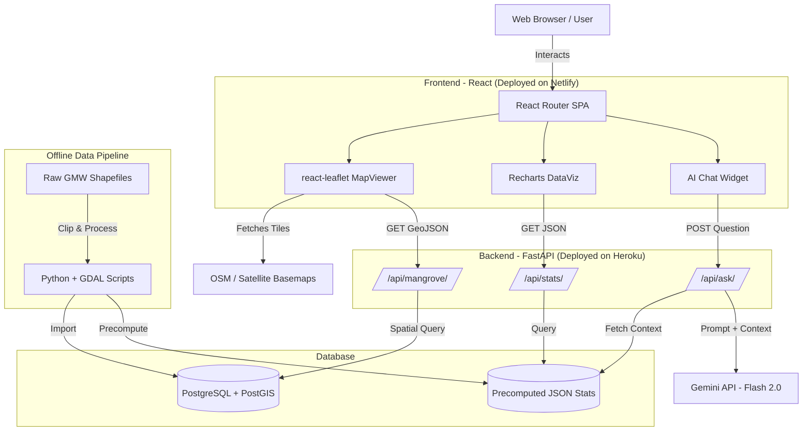

# MangroveSight Architecture Document

This document outlines the high-level architecture for the **MangroveSight** WebGIS application, based on the requirements defined in the `PRD.md`.

## 1. High-Level Architecture Diagram

The system follows a modern decoupled architecture (Client-Server model) with a dedicated Data Pipeline for preprocessing spatial data.

## 2. Component Details

### 2.1. Frontend (WebGIS Client)
- **Tech Stack**: React JS, Vite, React Router v6.
- **Responsibility**: Provides the user interface, renders interactive maps, displays statistical charts, and handles user interactions.
- **Key Libraries**:
  - `react-leaflet`: Renders the map and GeoJSON layers.
  - `recharts`: Visualizes mangrove area trends and changes.
- **Hosting**: Netlify.

### 2.2. Backend (API & AI Proxy)
- **Tech Stack**: Python, FastAPI.
- **Responsibility**: Serves geospatial data to the map, provides statistical data to the charts, and securely acts as a proxy for the AI assistant.
- **Key Endpoints**:
  - `GET /api/mangrove?year=YYYY`: Returns spatial boundaries as GeoJSON.
  - `GET /api/stats`: Returns precomputed area/change statistics.
  - `POST /api/ask`: Receives user chat queries and forwards them to the Gemini API.
- **Hosting**: Heroku (Web Dyno).

### 2.3. Database (Spatial & Stats)
- **Tech Stack**: PostgreSQL with PostGIS extension.
- **Responsibility**: Stores the clipped spatial data of mangrove extents (2000-2020) and the precomputed statistical data.
- **Hosting**: Heroku Postgres (Add-on).

### 2.4. Data Pipeline (Offline Preprocessing)
- **Tech Stack**: QGIS, Python, GDAL.
- **Responsibility**: A set of scripts that runs offline before deployment. It clips the global GMW data to the Teluk Balikpapan bounding box, calculates area (ha) and delta changes between epochs, exports statistics as JSON, and pushes the spatial data to PostGIS.

## 3. Deployment & CI/CD

- **GitHub Actions** is used as the CI/CD orchestrator.
- **Frontend Pipeline (`netlify-deploy.yml`)**: Triggered on push to `master`. Builds the Vite project and deploys the `dist/` folder to Netlify.
- **Backend Pipeline (`heroku-deploy.yml`)**: Triggered on push to `master`. Deploys the FastAPI code to Heroku.
- **Secrets Management**: GitHub Secrets hold the deploy tokens (`NETLIFY_AUTH_TOKEN`, `HEROKU_API_KEY`). Application secrets (like `GEMINI_API_KEY` and `DATABASE_URL`) are stored in Heroku's Config Vars, never in the frontend or source code.

## 4. AI Architecture (Precomputed Context Pattern)

To ensure fast response times, low API costs, and high accuracy (preventing LLM spatial hallucinations), the AI Assistant uses a **Precomputed Context Pattern**:

1. **No Live DB Analytics**: The LLM does not write SQL or interact directly with PostGIS.
2. **Context Injection**: When a user asks a question via `/api/ask`, the FastAPI backend fetches the precomputed JSON statistics (total area per year, net loss/gain, highest drop).
3. **System Prompt Formulation**: The backend wraps the user's question with a System Prompt that injects the JSON data: *"Answer the user's question based ONLY on this provided JSON data..."*
4. **Execution**: The Gemini API processes the prompt and returns a natural language answer based exclusively on the factual, precomputed metrics.
